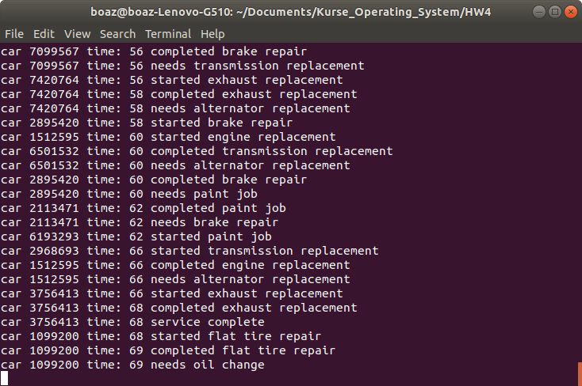

# CarGarage

## This Program for Linux in the C language. It uses threads and semaphores.

A garage has various types of resources: Car Lift, Front Alignment, Headlights Adjust, Oil Drain, Computerized Check...
Many cars come to the garage that require a repair. Each car may require several types of repairs.
Of course these may be different from one car to another.

Each type of treatment requires a fixed time: an hour, two hours, three, four hours more.
Just one repair is performed at a time on a car. even if the car needs several repairs: they are performed one after the other
if only the resources for their repair are available.

There are three input text files:
- resources.txt: List of resources in the garage.
  - The kind of resource: A unique number that identifies the resource.
  - Resource name.
  - The number of such systems owned by the garage
  
- repairs.txt: List of all kinds of repairs that can be obtained in the garage.
  - The kind of repair: A unique number that identifies the repair.
  - Repair name.
  - Number of hours this type of repair requires.
  - The number of resources required to perform this type of repair.
  - List of resource numbers needed to perform the repair
  
- request.txt: List of cars seeking repairs in the garage.
  - The license number of the car
  - Arrival time of the car at the garage (0 - 23).
  - The number of the type of repair the car needs (the list below).
  - List of repair numbers required for the same car (one or more).
  
 The program is a simulation of a real system.
 
 ## Part of a possible output sample:
 
 
 
 ## Running the Program on Linux:
 
 Open the terminal in the folder and paste these two lines: 
 $ gcc -pthread CarGarage.c -o CarGarage 
 $ ./CarGarage resources.txt repairs.txt requests.txt
 
 
 
 
 
 
 
 
 
